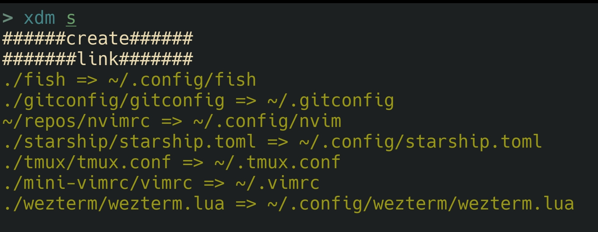

# xdm
XXiaoA's dotfiles manager



## 安装
### releases
从 [releases](https://github.com/XXiaoA/xdm/releases) 下载文件

### crates.io
从 [crates.io](https://crates.io/crates/xdm) 下载：`cargo install xdm`。记得在你的 $PATH 中添加 `~/.cargo/bin/`

### 源码
使用 git 克隆源代码。然后运行`cargo install --path .`。记得在你的 $PATH 中添加 `~/.cargo/bin/`


## 用法
> 运行 `xdm -h` 了解更多

首先，您应该创建一个名为 `xdm.yaml` 的 **yaml** 文件(不是必须的，而是 **推荐**)。

然后，您可以在包含 yaml 文件的目录中运行 `xdm s`。 Xdm 会自动在当前目录中找到`xdm.yaml`。或者你可以使用`xdm s file.yaml`来指定一个yaml文件。

此外，您可以链接特定的目录或文件。查看[这里](#manual)


### Manual
您可以在链接参数中设置 `manual` 为 true(请参阅 [配置](#配置))。

如果链接 manual 值为 true，则在运行 `xdm s` 后它不会被链接。但是您可以手动创建它：
```shell
xdm link {路径}
```

此外，无论一个链接是否是 manual，`link` 子命令都可以在所有链接中工作。

你可以用`xdm -a s`创建所有链接


## 配置
例如：
```yaml
link:
  ./path-to-original-file:
    path: ./path-to-linked-file

  ./nvim: ~/repos/nvim

  ./tmux:
    path: ~/.tmux.conf
    if: test -e /usr/bin/tmux # for fish shell

create:
  - ~/repos
```
注意：你必须有 `link` 选项。


### Link
链接文件/目录。

更重要的是，以下两种形式是相同的，它可以减少你的工作：
```yaml
link:
  ./a:
    path: b

  ./a: b
```

| 参数     | 说明                                                  | 类型   | 默认  |
| ---      | ---                                                   | ---    | :---: |
| path     |  链接文件的文件路径                                   | string | \\    |
| exist    |  仅在原始文件存在时才创建链接                         | bool   | true  |
| force    |  无论链接文件是否存在都创建链接                       | bool   | false |
| if       |  如果 shell 命令为真，则创建链接(半成品)                | string | \\    |
| create   |  根据需要创建链接的父目录                             | bool   | true  |
| manual   |  查看[这里](#manual)                                  | bool   | false |
| relink   |  如果链接路径是链接，则自动重新链接                   | bool   | true  |

### Create
创建目录


## 其他
### 注意
无论 `path-to-linked-file` 是目录还是文件，都不应该以 `/` 结尾。

但是 `path-to-original-file` 是否应该以 `/` 结尾取决于你自己。

### 完整示例
[XXiaoA/dotfiles](https://github.com/XXiaoA/dotfiles)


## License
[GNU General Public License v3.0](./LICENSE)
